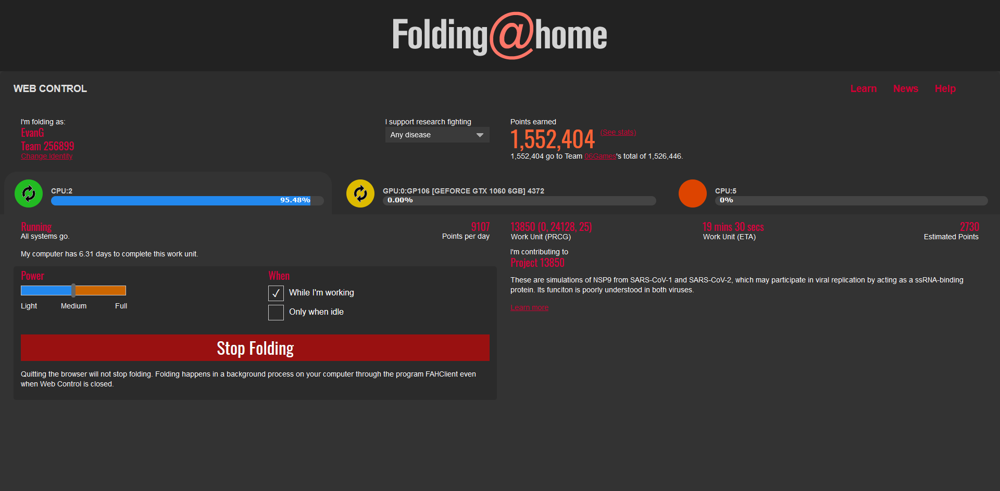

# Dark Folding@Home
A dark theme for Folding@Home

## Installation
Install [Stylus](https://add0n.com/stylus.html) if you are using Firefox, Chrome or Opera.
If you are on Safari, install [Cascadea](https://cascadea.app/). 

Then you can acquire this theme using one of these methods: 
📦 [Install the usercss](https://raw.githubusercontent.com/CustomStyles/Dark-FoldingAtHome/master/style.user.css) which supports automatic updates and personalization in real time. 

## Screenshot

