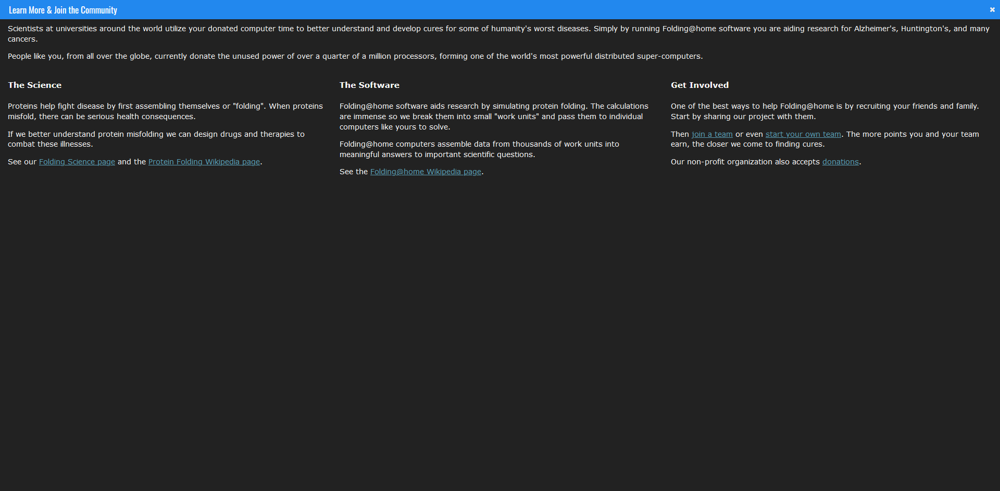

# Dark Folding@Home
A dark theme for Folding@Home

## Installation
Install [Stylus](https://add0n.com/stylus.html) if you are using Firefox, Chrome or Opera.
If you are on Safari, install [Cascadea](https://cascadea.app/). 

Then you can acquire this theme using one of these methods: 
📦 [Install the usercss](https://raw.githubusercontent.com/CustomStyles/Dark-FoldingAtHome/master/style.user.css) which supports automatic updates and personalization in real time. 

## Screenshot
<table style="width: 100%; text-align: center; table-layout: fixed;">
    <thead>
        <tr><th colspan=2>Client</th></tr>
    </thead>
    <tbody>
        <tr>
            <td></td>
            <td></td>
        </tr>
        <tr>
            <td>Client</td>
            <td>Popup</td>
        </tr>
    </tbody>
</table>

<table style="width: 100%; text-align: center; table-layout: fixed;">
    <thead>
        <tr><th colspan=3>Stats</th></tr>
    </thead>
    <tbody>
        <tr>
            <td></td>
            <td></td>
            <td></td>
        </tr>
        <tr>
            <td>User stats</td>
            <td>Team ranking</td>
            <td>OS stats</td>
        </tr>
    </tbody>
</table>